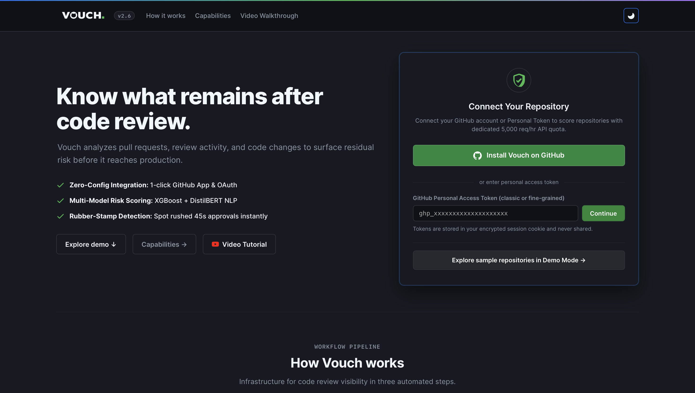
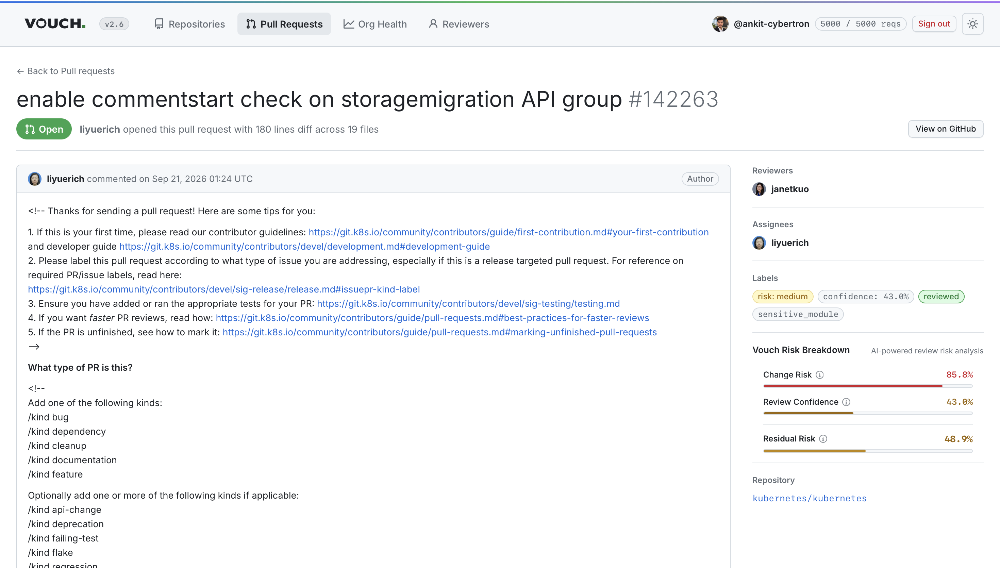
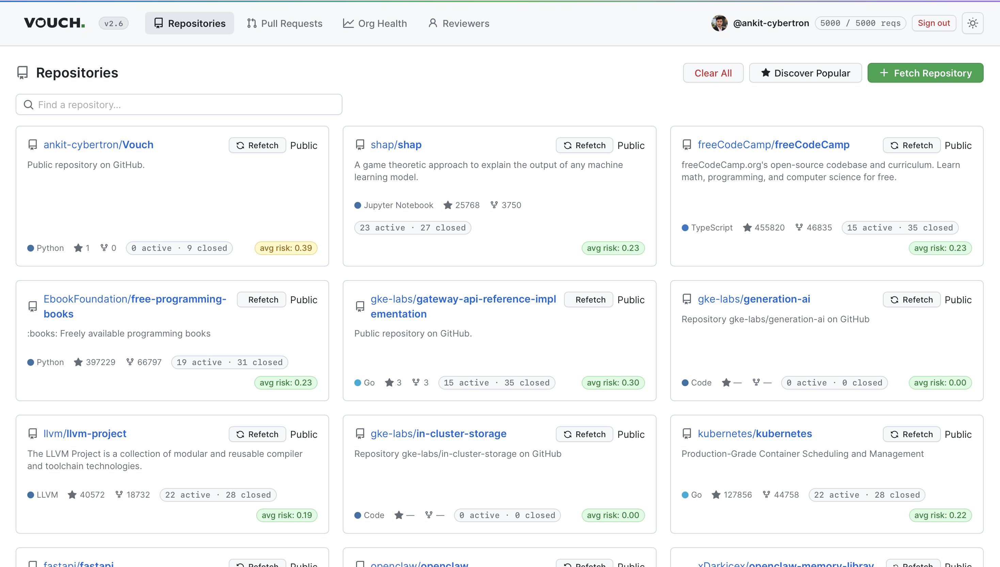
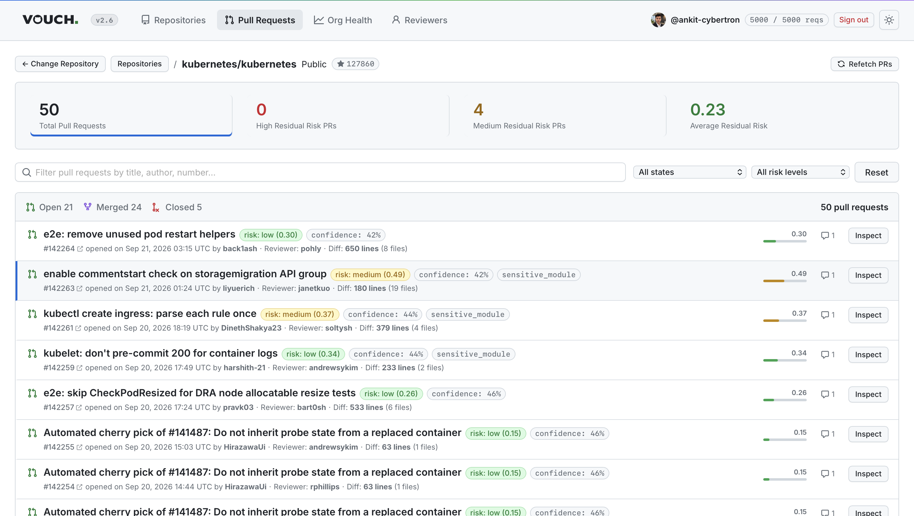
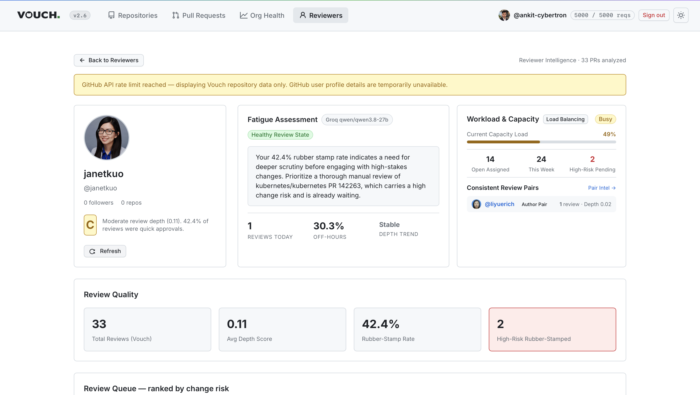
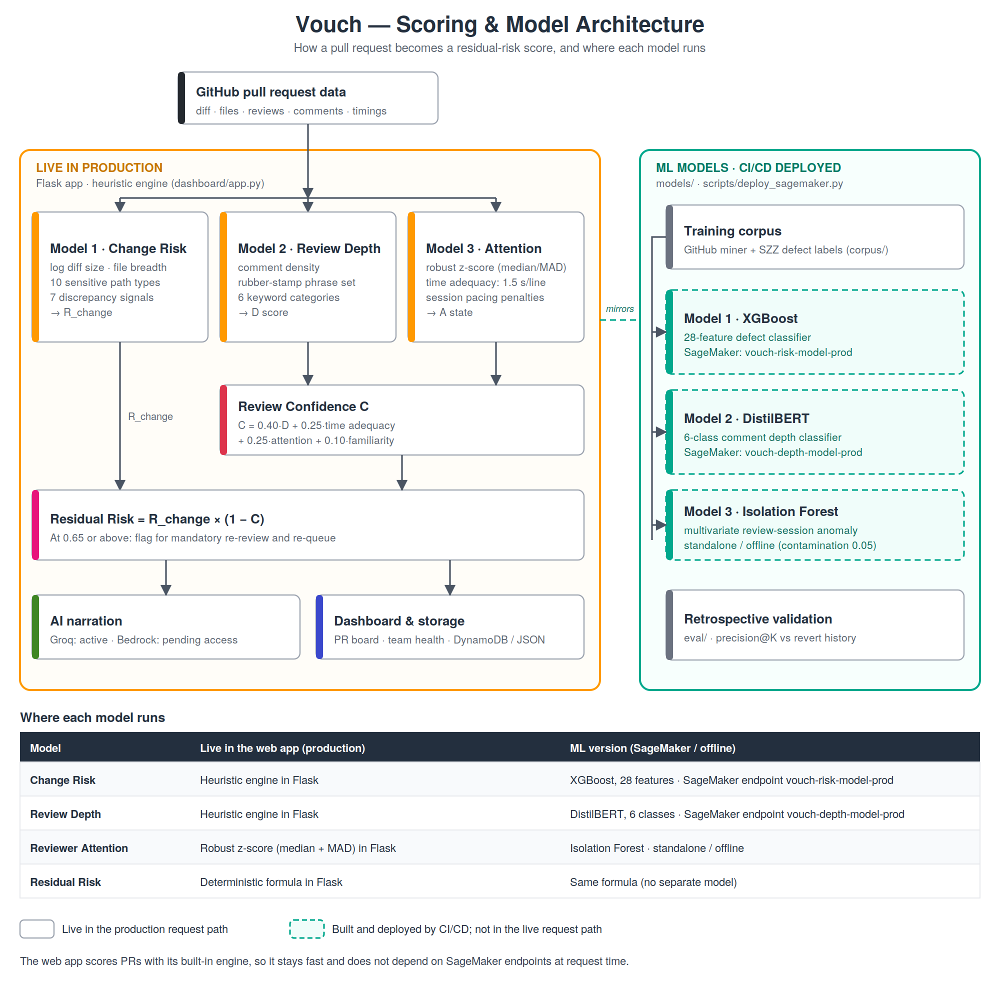
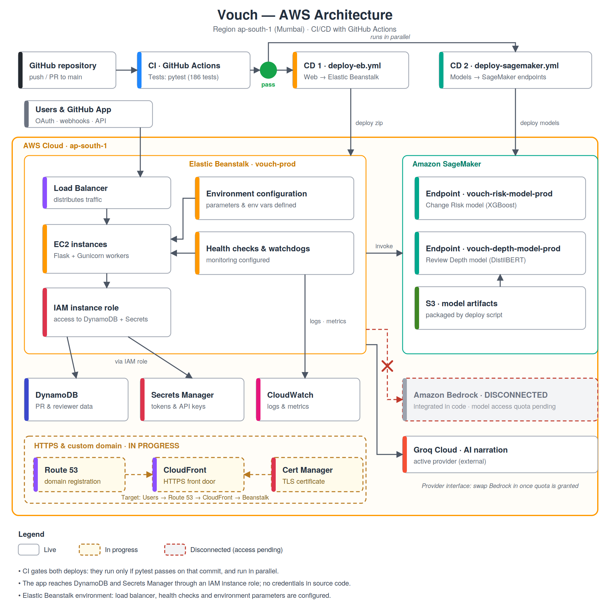

# Vouch

**Automated Code Review Intelligence & Risk-Aware PR Governance**

[](http://vouch.ap-south-1.elasticbeanstalk.com)
[](#aws-architecture)
[](https://github.com/ankit-cybertron/Vouch)
[](https://github.com/ankit-cybertron/Vouch/actions)
[](https://github.com/ankit-cybertron/Vouch)
[](https://www.python.org/)
[](http://vouch.ap-south-1.elasticbeanstalk.com)
[](https://youtu.be/m5iM3ArUbz0)

---

## Live Application & Demo

* **Live app:** [http://vouch.ap-south-1.elasticbeanstalk.com](http://vouch.ap-south-1.elasticbeanstalk.com)
  Hosted on AWS Elastic Beanstalk (`ap-south-1`, Mumbai) with Gunicorn workers, deployed automatically by GitHub Actions.
  <!-- TODO: add the HTTPS URL here once CloudFront / the custom domain is live -->
* **Demo video:** [https://youtu.be/m5iM3ArUbz0](https://youtu.be/m5iM3ArUbz0)
* **No login needed to look around:** open `/repos` for demo mode, or connect GitHub to score your own repositories.


<!-- TODO: screenshot of the landing page -->

---

## The Problem

Peer review is the last human check before code reaches production, but branch protection counts every approval the same. A 30-second "LGTM" on a 600-line change to an auth module satisfies the rule just as well as an hour-long security review.

We see this in open-source review queues: large, risky changes get approved quickly, and nobody measures how much review actually happened. Vouch measures that gap.

**Who it helps**
* Maintainers and small teams with few senior reviewers
* Engineering leads who need to know which merged PRs were barely reviewed
* Student and early-career teams learning what a good review looks like

---

## How It Works

Vouch scores two things for every pull request, then combines them:

```
Residual Risk = Change Risk × (1 − Review Confidence)
```

* **Change Risk:** how dangerous the change is (diff size, file churn, sensitive paths such as auth, crypto, billing and migrations).
* **Review Confidence:** how much scrutiny the change received (comment depth, reviewer attention, session timing).
* **Residual Risk:** the risk that survived review. At **0.65 or above**, the PR is flagged for mandatory re-review.

### Worked example from the live app

`kubernetes/kubernetes` PR #142263 (180 lines, 19 files, sensitive module touched):

| Change Risk | Review Confidence | Residual Risk | Outcome |
|:---:|:---:|:---:|:---|
| 85.8% | 43.0% | 48.9% | Medium: below the 0.65 flag threshold |


<!-- TODO: screenshot of the PR detail page with the "Vouch Risk Breakdown" panel -->

---

## Screenshots

**Repository catalog:** track any public repository, or discover popular ones.


<!-- TODO: screenshot of /repos -->

**PR triage board:** every PR ranked by residual risk, with search and filters.


<!-- TODO: screenshot of /board for a repository -->

**Reviewer intelligence:** review depth, rubber-stamp rate, workload and pairs.


<!-- TODO: screenshot of the reviewer page, ideally after the rate-limit banner is fixed -->


---

## Core Capabilities

* **Rubber-stamp detection:** flags approvals given in under a minute, empty reviews and non-technical comments on large changes.
* **Residual risk scoring:** a continuous score instead of a binary approve/block checkbox.
* **PR triage and audit:** sensitive-file mapping and per-feature risk attribution.
* **Reviewer workload and fatigue signals:** session velocity, off-hours volume and queue pressure.
* **Pair review intelligence:** finds reciprocal rubber-stamping between reviewer pairs.
* **Review SLA forecasting:** estimates turnaround for open PRs.
* **AI narration:** one plain-language sentence explaining why a PR was flagged (see [AI narration and the Bedrock status](#ai-narration-and-the-bedrock-status)).
* **GitHub App onboarding:** short-lived installation tokens and a dedicated 5,000 requests/hour quota.

---

## Models



| Model | Live in the web app (production) | ML version (SageMaker / offline) |
|:---|:---|:---|
| Change Risk | Heuristic engine in Flask: log diff size, file breadth, 10 sensitive path categories, 7 discrepancy signals | XGBoost, 28 features, on SageMaker endpoint `vouch-risk-model-prod` |
| Review Depth | Heuristic engine in Flask: comment density, rubber-stamp phrases, 6 keyword categories | DistilBERT, 6 classes, on SageMaker endpoint `vouch-depth-model-prod` |
| Reviewer Attention | Robust z-score (median + MAD), time adequacy and session pacing, in Flask | Isolation Forest anomaly detector, standalone / offline |
| Review Confidence | `C = 0.40·D + 0.25·time adequacy + 0.25·attention + 0.10·familiarity` | Same formula |
| Residual Risk | `R_change × (1 − C)`, flagged at 0.65 or above | Same formula |

The live web app scores pull requests with its built-in heuristic engine, which mirrors the logic of the three models. This keeps scoring fast and independent of SageMaker at request time. The trained XGBoost and DistilBERT models are packaged and deployed to SageMaker endpoints by the CI/CD pipeline, and are not called synchronously by the web app yet.

### Measured results

<!-- TODO: fill these from eval/. If a number was not measured, delete the row. Do not claim targets. -->

| Metric | Result | Dataset |
|:---|:---:|:---|
| Change Risk ROC-AUC | [TODO] | [TODO: dataset and size] |
| Review Depth macro F1 | [TODO] | [TODO] |
| Rubber-stamp precision@K | [TODO] | [TODO] |
## AWS Architecture



### What is deployed

| Service | Role |
|:---|:---|
| **AWS Elastic Beanstalk** | Hosts the Flask + Gunicorn app as environment `vouch-prod` in `ap-south-1`, behind a load balancer, with environment parameters and health checks (watchdogs) configured |
| **Amazon SageMaker** | Hosts the Change Risk and Review Depth models as endpoints (`vouch-risk-model-prod`, `vouch-depth-model-prod`), deployed automatically by CI/CD |
| **Amazon S3** | Stores the packaged model artifacts used by the SageMaker deployment |
| **Amazon DynamoDB** | Serverless persistence for scored PRs and reviewer data |
| **AWS IAM** | An instance role gives the app least-privilege access to DynamoDB and Secrets Manager |
| **AWS Secrets Manager** | GitHub and API credentials, kept out of source code |
| **Amazon CloudWatch** | Application logs and metrics |


### CI/CD pipeline

Every push and pull request runs the test suite. Deployment happens only if it passes, and the two deploys run in parallel:

```
push to main → Tests (pytest, 186 tests) ─ pass ─┬─→ deploy-eb.yml         → Elastic Beanstalk (web app)
                                                 └─→ deploy-sagemaker.yml  → SageMaker endpoints (models)
```

| Workflow | Trigger | What it does |
|:---|:---|:---|
| `test.yml` | Push and pull requests | Runs the pytest suite |
| `deploy-eb.yml` | Tests succeed on `main` | Builds a lightweight web package from `requirements-web.txt` (no heavy ML packages) and deploys it to Elastic Beanstalk |
| `deploy-sagemaker.yml` | Tests succeed on `main` | Packages and deploys the models to SageMaker with `scripts/deploy_sagemaker.py` |

### AI narration and the Bedrock status

Vouch was designed to generate its risk explanations with **Amazon Bedrock**. The Bedrock integration is built into the code, but our new account's model access quota was zero during the hackathon and the access request was not approved in time, so Bedrock shows as **disconnected**. Production narration is served by **Groq**, behind a provider interface. When Bedrock access is granted, it can replace Groq without changing the rest of the app.
<!-- TODO: if you get Bedrock working before the deadline, replace this section with the working setup. -->

### In progress

* **Route 53** for a custom domain (domain registration is under way).
* **HTTPS** through CloudFront and Certificate Manager. <!-- TODO: edit or remove if either is not part of your plan -->

### Designed, not deployed

The `infra/` folder also holds SAM templates and a Step Functions design for an event-driven pipeline (API Gateway → Lambda → EventBridge → Step Functions → scoring). This is a target architecture and is **not** part of the live deployment. <!-- TODO: edit this if any of it is actually deployed -->

---

## What We Learned

* **DynamoDB pushes you to design around access patterns, not schemas.** We shaped our storage around how the dashboard reads data.
* **Managed services cut setup time.** Elastic Beanstalk, IAM and Secrets Manager let us spend the weekend on scoring logic, not server setup.
* **Splitting web and model deploys keeps releases light.** Elastic Beanstalk gets a slim package, and the heavy ML dependencies ship only through the SageMaker pipeline.
* **Build the fallback early.** Bedrock quota was a surprise, so we built the provider interface and the Groq failover.
* <!-- TODO: add one thing you learned about SageMaker or the ML side -->

---

## How Vouch Compares

| Capability | Linters & SAST (SonarQube, CodeQL) | GitHub branch protection | Vouch |
|:---|:---:|:---:|:---:|
| Measures human review rigor | ❌ | ❌ | ✅ |
| Detects rubber-stamp approvals | ❌ | ❌ | ✅ |
| Critical-module awareness | ⚠️ partial | ⚠️ CODEOWNERS only | ✅ |
| Reviewer fatigue and pair patterns | ❌ | ❌ | ✅ |
| Explains why a PR was flagged | ⚠️ rule-based | ❌ | ✅ |

---

## Quickstart & Local Development

### 1. Clone and install

```bash
git clone https://github.com/ankit-cybertron/Vouch.git
cd Vouch

python3 -m venv .venv
source .venv/bin/activate
pip install -r requirements.txt
```

`requirements-web.txt` holds the web app dependencies used for Elastic Beanstalk, and `requirements-ml.txt` holds the model dependencies used by the SageMaker pipeline.

### 2. Configure (optional)

Create a `.env` file in the project root:

```env
GITHUB_TOKEN=ghp_your_token          # raises GitHub API limit from 60 to 5,000 requests/hour
GROQ_API_KEY=gsk_your_key            # enables AI narration
USE_DYNAMODB=false                   # true for AWS DynamoDB persistence
AWS_REGION=ap-south-1
```

### 3. Run

```bash
python main.py --port 5001
```

* Landing page: [http://localhost:5001/](http://localhost:5001/)
* Repositories: [http://localhost:5001/repos](http://localhost:5001/repos)
* PR board: [http://localhost:5001/board](http://localhost:5001/board)
* Reviewers: [http://localhost:5001/reviewer](http://localhost:5001/reviewer)
* Pair intelligence: [http://localhost:5001/pair-intelligence](http://localhost:5001/pair-intelligence)
* Team health: [http://localhost:5001/team-health](http://localhost:5001/team-health)

### 4. Test

```bash
pytest
```

186 tests cover feature extraction, risk calibration, route handlers, storage persistence and discrepancy detection.

---

## Documentation

* [Technical Architecture & Specifications](docs/README.md)
* [System Architecture](docs/ARCHITECTURE.md)
* [Model Details](docs/MODELS.md)
* [Dashboard & API Reference](docs/DASHBOARD_AND_API.md)
* [AWS Deployment Manual](docs/AWS_DEPLOYMENT.md)

---

## Team: Quantified Minds

* [Ankit Kumar Tiwari](https://github.com/ankit-cybertron): architecture, risk models, GitHub integration, AWS setup, testing and CI/CD
* [Ishaan Chaturvedi](https://github.com/Ishaan-Chaturved1): dashboard, reviewer workload and pair insights, team health
* [Vaibhav Jain](https://github.com/vaibhav4561): landing page and visual design

*Built for WeMakeDevs "First Commit", Bharat Builds Tour · Event 01*